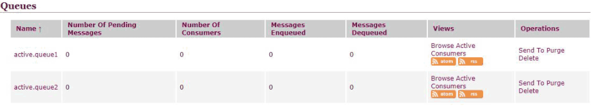

---
id="2018-09-05-10-38"
title="springboot整合ActiveMQ（1）"
headWord="稍大的项目中都会用到mq消息队列，so这个自然也是要学的，为啥是activeMQ呢?刚好目前的项目中用的就是这个拉。"
tags=["java", "spring","springboot","消息队列","activeMQ"]
category="java"
serie="spring boot学习"
---

**说明：acitveMQ 版本为：5.9.1，springboot 版本为 2.0.3,项目地址：[点击跳转](https://github.com/FleyX/demo-project/tree/master/jms_demo)**<br/>

## 一. 下载安装（windows）

&emsp;&emsp;官方下载地址:[点我跳转](http://activemq.apache.org/download-archives.html),选择 windows 安装包下载,然后解压，解压后运行 bin 目录下的**activemq.bat**启动服务,无报错即可启动成功。默认管理地址为：[localhost:8161/admin](localhost:8161/admin),默认管理员账号密码为**admin**/**admin**。

## 二. springboot 整合

### 1. 创建 springboot 项目

&emsp;&emsp;创建 springboot web 项目，加入 spring-boot-starter-activemq 依赖。

```xml
<dependency>
    <groupId>org.springframework.boot</groupId>
    <artifactId>spring-boot-starter-activemq</artifactId>
</dependency>
```

&emsp;&emsp;然后编辑配合文件，加上一个配置：61616 为 activeMQ 的默认端口，暂时不做其他配置，使用默认值。

```yml
spring:
  activemq:
    broker-url: tcp://localhost:61616
```

### 2. 创建生产者消费者

&emsp;&emsp;springboot 中 activeMQ 的默认配置为**生产-消费者模式**，还有一种模式为**发布-订阅模式**后面再讲。项目目录如下：


&emsp;&emsp;首先编写配置类 Config.java，代码如下

```java
@Configuration
public class Config {
    @Bean(name = "queue2")
    public Queue queue2(){
        return new ActiveMQQueue("active.queue2");
    }

    @Bean(name = "queue1")
    public Queue queue1(){
        return new ActiveMQQueue("active.queue1");
    }
}
```

上面的代码建立了两个消息队列 queue1，queue2,分别由 queue1 和 queue2 这两个 Bean 注入到 Spring 容器中。程序运行后会在 activeMQ 的管理页面->queue 中看到如下：


&emsp;&emsp;生产者 Producer.java 代码如下：

```java
@RestController
public class Producer {
    @Autowired
    private JmsMessagingTemplate jmsMessagingTemplate;
    @Autowired()
    @Qualifier("queue2")
    private Queue queue2;
    @Autowired()
    @Qualifier("queue1")
    private Queue queue1;

    @GetMapping("/queue2")
    public void sendMessage1(String message){
            jmsMessagingTemplate.convertAndSend(queue2,"I'm from queue2:"+message);
    }

    @GetMapping("/queue1")
    public void sendMessage2(String message){
        jmsMessagingTemplate.convertAndSend(queue1,"I'm from queue1:"+message);
    }
}
```

上面的类创建了两个 GET 接口，访问这两个接口分别向 queue1 和 queue2 中发送消息。

消费者 Comsumer.java 代码如下：

```java
@Component //将该类注解到Spring 容器中
public class Comsumer {
    //接受消息队列1消息
    @JmsListener(destination = "active.queue1") //监听active.queue1消息队列
    public void readActiveQueue11(String message){
        System.out.println(1+message);
    }

    //接受消息队列1消息
    @JmsListener(destination = "active.queue1")
    public void readActiveQueue12(String message){
        System.out.println(2+message);
    }

    //接受消息队列2消息
    @JmsListener(destination = "active.queue2")
    public void readActiveQueue21(String message){
        System.out.println(1+message);
    }

    //接受消息队列2消息
    @JmsListener(destination = "active.queue2")
    public void readActiveQueue22(String message){
        System.out.println(2+message);
    }
}
```

上面的代码定义了 4 个消费者，每两个消费一个消息队列。

### 3. 运行

&emsp;&emsp;启动项目后分别向/queue1?message=niihao,/queue2?message=nihaoa 发送 http 请求，然后我们可以在控制台中看到如下输出：

```
2I'm from queue2:nihaoa
1I'm from queue2:nihaoa
2I'm from queue1:nihao
1I'm from queue1:nihao
```

消息都成功被消费者消费，从打印结果也可看出生产者消费者的一个特点：一个消息只会被一个消费者消费。同时在管理页面中可以看到：

每个消息队列有两个消费者，队列进入了三个消息，出了三个消息，说明消息都被消费掉了，如果注释掉消费者代码，再次运行，然后发送消息就会发现 MessagesEnqueued 数量大于 MessagesDequeued，然后再让消费者上线会立即消费掉队列中的消息。
