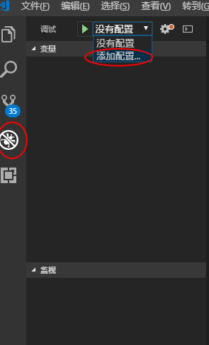
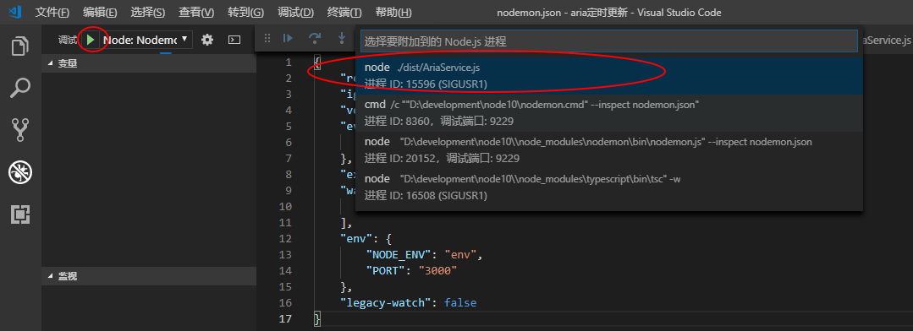

---
id="2018-12-17-13-58"
title="vscode开发调试typescript"
headWord="本篇用于记录如何在vscode下开发typescript以及端点调试ts代码"
tags=["vscode", "node","typescript","ts"]
category="node"
serie="node开发环境配置"
---

### 1、安装 typescript

&emsp;&emsp;npm 全局安装 typescript

```bash
npm i -g typescript
```

### 2、初始化 ts 配置

&emsp;&emsp;以 test 项目为例，在 test 目录下执行`tsc --init`,会在项目目录下产生一个`tsconfig.json`的配置文件,每项配置都有说明，如下图所示：


主要用到的配置项如下：

```javascript
{
    "compilerOptions": {
        "module": "commonjs",   //指定生成哪个模块系统代码
        "target": "ES2017",        //目标代码类型
        "noImplicitAny": false, //在表达式和声明上有隐含的'any'类型时报错。
        "sourceMap": true,     //用于debug,断点调试需打开
        "rootDir":"./",      //需要编译的目录
        "outDir":"./dist",     //编译后的js存放路径
        "watch":true            //在监视模式下运行编译器。会监视输出文件，在它们改变时重新编译。
        "strict":true  //严格模式
    },
    //需要监控的路径,非必要无需配置，有rootDir就够了
    "include":[
        "./"
    ],
    //需要排除的路径，非必要无需配置
    //排除监控目录
    "exclude":[
        "node_module",
        "temp"
    ]
}
```

### 3、编译

&emsp;&emsp;执行`tsc -w`,将 ts 编译位 js 并输出到 dist 目录下，`-w`监控文件变动，自动编译。

### 4、断点运行

&emsp;&emsp;首先添加 launch.json,如图所示：



选中 node 环境，然后将要调试的文件改为输出目录中对应的 js 文件,修改 program 属性：

```json
"program": "${workspaceFolder}\\dist\\index.js"
```

最后**F5**运行即可断点调试。

### 5、热更新

&emsp;&emsp;如何在修改文件保存后自动重启服务器,首先全局安装`nodemon`,然后在 test 根目录下编写 nodemon 配置文件--nodemon.json：（实际使用中不能带注释，需删除）

```json
{
  "restartable": "rs", //重启的命令，默认是 rs
  "ignore": [""], //忽略的文件后缀名或者文件夹，文件路径的书写用相对于 nodemon.json 所在位置的相对路径
  "verbose": true, //表示输出详细启动与重启信息
  "events": {
    "start": "node ./dist/index.js", //子进程（即监控的应用）启动
    "crash": "", //子进程崩溃，不会触发 exit
    "exit": "", //子进程完全退出，不是非正常的崩溃
    "restart": "" //子进程重启
  },
  "ext": "js json", //监控指定后缀名的文件，用空格间隔。默认监控的后缀文件：.js, .coffee, .litcoffee, .json。但是对于没有文件后缀的文件，比如 www 文件，我暂时找不到怎么用 nodemon 去监控，就算在 watch 中包含了，nodemon 也会忽略掉
  "watch": ["./src/**"],
  "env": {
    "NODE_ENV": "env", //  env： 是开发环境; 运行环境 development; production 是生产环境
    "PORT": "3000"
  },
  "legacy-watch": false //nodemon 使用 Chokidar 作为底层监控系统，但是如果监控失效，或者提示没有需要监控的文件时，就需要使用轮询模式（polling mode），即设置 legacy-watch 为 true，也可以在命令行中指定
}
```

然后使用`nodemon --inspect nodemon.json`命令启动(--inspect 是 vscode 断点调试关键），接着在.vscode 目录中将 launch.json 修改为下面的代码：

```json
{
  "version": "0.2.0",
  "configurations": [
    {
      "type": "node",
      "request": "attach",
      "name": "Node: Nodemon",
      "processId": "${command:PickProcess}",
      "restart": true,
      "protocol": "inspector"
    }
  ]
}
```

最后调试页面启动调试，选择代码真实运行的进程，如下图所示：



&emsp;&emsp;大功告成。。
