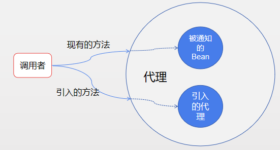

[id]: 6f135410d6c111e8aa858b6a40460626
 ## 一.面向切面编程

&emsp;&emsp;Spring的基础是IOC和AOP，前面两节对IOC和DI做了简单总结，这里再对AOP进行一个学习总结，Spring基础就算有一个初步了解了。

&emsp;&emsp;在软件开发中，我们可能需要一些跟业务无关但是又必须做的东西，比如日志，事务等，这些分布于应用中多处的功能被称为横切关注点，通常横切关注点从概念上是与应用的业务逻辑相分离的。如何将这些横切关注点与业务逻辑在代码层面进行分离，是面向切面编程（**AOP**）所要解决的。

​	横切关注点可以被描述为影响应用多处的功能，切面能够帮助我们模块化横切关注点。下图直观呈现了横切关注点的概念:


途中CourseService，StudentService，MiscService都需要类似安全、事务这样的辅助功能，这些辅助功能就被称为横切关注点。

&emsp;&emsp;**继承**和**委托**是最常见的实现重用通用功能的面向对象技术。但是如果在整个程序中使用相同的基类继承往往会导致一个脆弱的对象体系；而使用委托可能需要对委托对象进行复杂的调用。

​	切面提供了取代继承和委托的另一种选择，而且更加清晰简洁。在面向切面编程时，我们任然在一个地方定义通用功能，但是我们可以通过声明的方式定义这个功能以何种方式在何处应用，而无需修改受影响的类，受影响类完全感受不到切面的存在。

## 二.AOP常用术语

&emsp;&emsp;下面是AOP中常用的名词。

### 1. 通知（Advice）

&emsp;&emsp;通知定义了切面是什么以及何时使用。出了描述切面要完成的工作，通知还解决了何时执行这个工作的问题。Sping切面可以应用以下5种类型的通知。

- **Before**  在方法被调用之前调用通知
- **After**  在方法完成之后调用通知，无论方法执行是否成功
- **After-returning**  在方法成功执行后调用通知
- **After-throwing**  在方法抛出异常后调用通知
- **Around**  通知包裹了被通知的方法，在被通知的方法调用前和调用后执行

###2.连接点（Joinpoint）

&emsp;&emsp;应用可能有很多个时机应用通知，这些时机被称为连接点。连接点是应用在执行过程中能够插入切面的一个点，这个点可以是调用方法时、抛出异常时、甚至是修改字段时。切面代码可以利用这些切入到应用的正常流程中，并添加新的行为。

### 3.切点（Pointcut）

&emsp;&emsp;切点定义了通知所要织入的一个或多个连接点。如果说通知定义了切面的“**什么**”和“**何时**”，那么切点就定义了“**何处**”。通常使用明确的类和方法名称来指定切点，或者利用正则表达式定义匹配的类和方法来指定这些切点。有些AOP框架允许我们创建动态的切点，可以更具运行时的策略来决定是否应用通知。

### 4.切面（Aspect）

&emsp;&emsp;切面是通知和切点的结合。通知和切点定义了关于切面的全部内容，**是什么**，在**何时**、**何处**完成其功能。

### 5.引入

&emsp;&emsp;引入允许我们想现有的类添加新方法或属性。即在无需修改现有类的情况下让它们具有新的行为和状态。

### 6.织入

&emsp;&emsp;织入是将切面应用到目标对象来创建新的代理对象的过程。切面在指定的连接点被织入到目标对象中，在目标对象的生命周期里有多个点可以进行织入。

- 编译期：切面在目标类编译时被织入。这种方式需要特殊的编译期，比如AspectJ的织入编译期
- 类加载期：切面在目标类加载到JVM时被织入。这种方式需要特殊的加载器，它可以在目标类被引入应用之前增强该目标类的字节码，例如AspectJ5的**LTW**（load-time weaving）
- 运行期：切面在应用运行的某个时刻被织入。一般情况下AOP容器会为目标对象动态创建一个代理对象

##三.Spring AOP

&emsp;&emsp;Spring在运行期通知对象，通过在代理类中包裹切面，Spring在运行期将切面织入到Spring管理的Bean中。代理类封装了目标类，并拦截被通知的方法的调用，再将调用转发给真正的目标Bean。由于Spring是基于动态代理，所有Spring只支持方法连接点，如果需要方法拦截之外的连接点拦截，我们可以利用Aspect来协助SpringAOP。

&emsp;&emsp;Spring在运行期通知对象，通过在代理类中包裹切面，Spring在运行期将切面织入到Spring管理的Bean中。代理类封装了目标类，并拦截被通知的方法的调用，再将调用转发给真正的目标Bean。由于Spring是基于动态代理，所有Spring只支持方法连接点，如果需要方法拦截之外的连接点拦截，我们可以利用Aspect来协助SpringAOP。

### 1、定义切点

&emsp;&emsp;在SpringAOP中，需要使用AspectJ的切点表达式语言来定义切点。Spring只支持AspectJ的部分切点指示器，如下表所示：

| AspectJ指示器 | 描述                                                         |
| ------------- | ------------------------------------------------------------ |
| arg()         | 限制连接点匹配参数为指定类型的执行方法                       |
| @args()       | 限制连接点匹配参数由指定注解标注的执行方法                   |
| execution()   | 用于匹配是连接点的执行方法                                   |
| this()        | 限制连接点匹配AOP代理的Bean引用为指导类型的类                |
| target()      | 限制连接点匹配目标对象为指定类型的类                         |
| @target()     | 限制连接点匹配特定的执行对象，这些对象对应的类要具备指定类型的注解 |
| within()      | 限制连接点匹配指定的类型                                     |
| @within()     | 限制连接点匹配指定注解所标注的类型（当使用SpringAOP时，方法定义在由指定的注解所标注的类里） |
| @annotation   | 限制匹配带有指定注解连接点                                   |
| bean()        | 使用Bean ID或Bean名称作为参数来限制切点只匹配特定的Bean      |

&emsp;其中只有execution指示器是唯一的执行匹配，其他都是限制匹配。因此execution指示器是

其中只有execution指示器是唯一的执行匹配，其他都是限制匹配。因此execution指示器是我们在编写切点定义时最主要使用的指示器。

### 2、编写切点

&emsp;&emsp;假设我们要使用execution()指示器选择Hello类的sayHello()方法，表达式如下：

```java
execution(* com.test.Hello.sayHello(..))
```

方法表达式以*** **号开始，说明不管方法返回值的类型。然后指定全限定类名和方法名。对于方法参数列表，我们使用（**）标识切点选择任意的sayHello()方法，无论方法入参是什么。

&emsp;&emsp;同时我们可以使用&&(and)，||(or)，！(not)来连接指示器,如下所示：

```java
execution(* com.test.Hello.sayHello(..)) and !bean(xiaobu)
```

### 3、申明切面

&emsp;&emsp;在经典Spring AOP中使用ProxyFactoryBean非常复杂，因此提供了申明式切面的选择，在Spring的AOP配置命名空间中有如下配置元素：

| AOP配置元素                    | 描述                                                        |
| ------------------------------ | ----------------------------------------------------------- |
| &lt;aop:advisor &gt;           | 定义AOP通知器                                               |
| &lt;aop:after &gt;             | 定义AOP后置通知（无论被通知方法是否执行成功）               |
| &lt;aop:after-returning  &gt;  | 定义AOP after-returning通知                                 |
| &lt;aop:after-throwing &gt;    | 定义after-throwing                                          |
| &lt;aop:around &gt;            | 定义AOP环绕通知                                             |
| &lt;aop:aspect &gt;            | 定义切面                                                    |
| &lt;aop:aspectj-autoproxy &gt; | 启用@AspectJ注解驱动的切面                                  |
| &lt;aop:before &gt;            | 定义AOP前置通知                                             |
| &lt;aop:config &gt;            | 顶层的AOP配置元素。大多数的&lt;aop:* &gt;元素必须包含在其中 |
| &lt;aop:declare-parents &gt;   | 为被通知的对象引入额外的接口，并透明的实现                  |
| &lt;aop:pointcut &gt;          | 定义切点                                                    |

### 4、实现

假设有一个演员类`Actor`，演员类中有一个表演方法`perform()`,然后还有一个观众类`Audience`,这两个类都在包`com.example.springtest`下，Audience类主要方法如下：

```java
public class Audience{
    //搬凳子
    public void takeSeats(){}
    //欢呼
    public void applaud(){}
    //计时，环绕通知需要一个ProceedingJoinPoint参数
    public void timing(ProceedingJoinPoint joinPoint){
        joinPoint.proceed();
    }
    //演砸了
    public void demandRefund(){}
    //测试带参数
    public void dealString(String word){}
    
}
```

#### a、xml配置实现

&emsp;&emsp;首先将Audience配置到springIOC中:

```xml
<bean id="audience" class="com.example.springtest.Audience"/>
```

然后申明通知：

```xml
<aop:config>
  <aop:aspect ref="audience">
    <!-- 申明切点 -->
    <aop:pointcut id="performance" expression="execution(* com.example.springtest.Performer.perform(..))"/>
    <!-- 声明传递参数切点 -->
    <aop:pointcut id="performanceStr" expression="execution(* com.example.springtest.Performer.performArg(String) and args(word))"/>  
    <!-- 前置通知 -->
    <aop:before pointcut-ref="performance" method="takeSeats"/>
    <!-- 执行成功通知 -->
    <aop:after-returning pointcout-ref="performance" method="applaud"/>
    <!-- 执行异常通知 -->
    <aop:after-throwing pointcut-ref="performance" method="demandRefund"/>
    <!-- 环绕通知 -->
    <aop:around pointcut-ref="performance" method="timing"/> 
    <!-- 传递参数 -->
    <aop:before pointcut-ref="performanceStr" arg-names="word" method="dealString"/>
  </aop:aspect>
</aop:config>
```


#### b、注解实现

直接在Audience类上加注解（Aspect注解并不能被spring自动发现并注册，要么写到xml中，要么使用@Aspectj注解或者加一个@Component注解），如下所示：

```java
@Aspect
public class Audience{
    //定义切点
    @Pointcut(execution(* com.example.springtest.Performer.perform(..)))
    public void perform(){}
    
    //定义带参数切点
    @Pointcut(execution(* com.example.springtest.Performer.performArg(String) and args(word)))
    public void performStr(String word){}
    
    //搬凳子
    @Before("perform()")
    public void takeSeats(){}
    
    //欢呼
    @AfterReturning("perform()")
    public void applaud(){}
    
    //计时，环绕通知需要一个ProceedingJoinPoint参数
    @Around("perform()")
    public void timing(ProceedingJoinPoint joinPoint){
        joinPoint.proceed();
    }
    
    //演砸了
    @AfterThrowing("perform()")
    public void demandRefund(){}
    
    //带参数
    @Before("performStr(word)")
    public void dealString(String word){}
}
```

#### c、通过切面引入新功能

&emsp;&emsp;既然可以用AOP为对象拥有的方法添加新功能，那为什么不能为对象增加新的方法呢？利用被称为**引入**的AOP概念，切面可以为Spring Bean添加新的方法，示例图如下：



当引入接口的方法被调用时，代理将此调用委托给实现了新接口的某个其他对象。实际上，Bean的实现被拆分到了多个类。

- xml引入需要使用&lt;aop:declare-parents &gt;元素：

  ```xml
  <aop:aspect>
    <aop:declare-parents types-matching="com.fxb.springtest.Performer+"
      implement-interface="com.fxb.springtest.AddTestInterface"
      default-impl="com.fxb.springtest.AddTestImpl"/>
  </aop:aspect>
  ```

  顾名思义\&lt;declare-parents&gt;声明了此切面所通知的Bean在它的对象层次结构中有了新的父类型。其中types-matching指定增强的类；implement-interface指定实现新方法的接口；default-imple指定实现了implement-interface接口的实现类，也可以用delegate-ref来指定一个Bean的引用。

- 注解引入，通过`@DeclareParents`注解

  ```xml
  @DeclareParents(value="com.fxb.springtest.Performer+",
  	defaultImpl=AddTestImpl.class)
  public static AddTestInterface addTestInterface;
  ```

  同xml实现一样，注解也由三部分组成：1、value属性相当于tpes-matching属性，标识被增强的类；2、defaultImpl等同于default-imple，指定接口的实现类；3、有@DeclareParents注解所标注的static属性指定了将被引入的接口。

