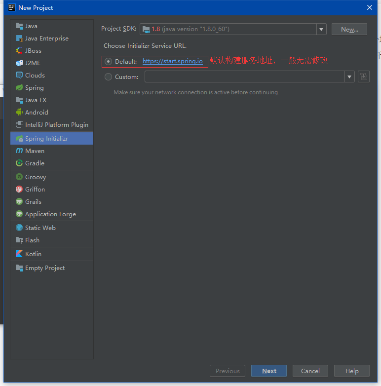
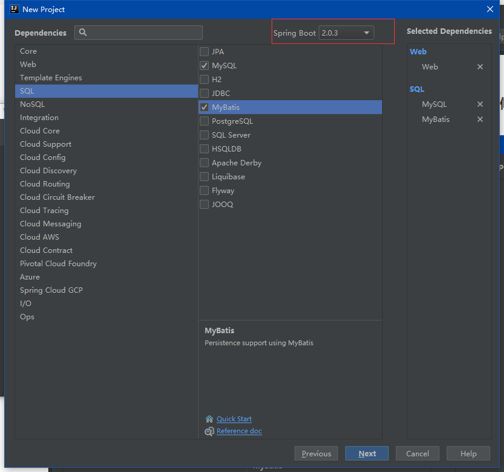
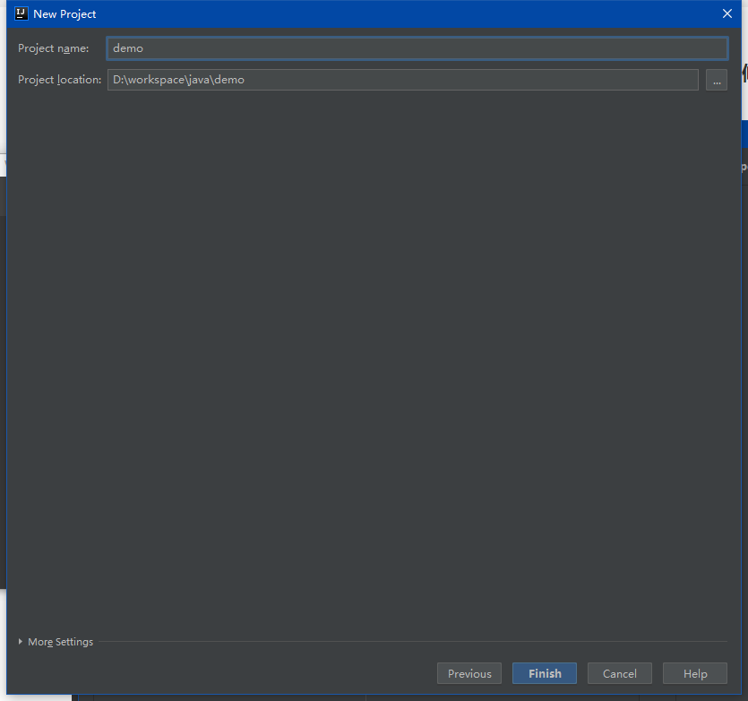
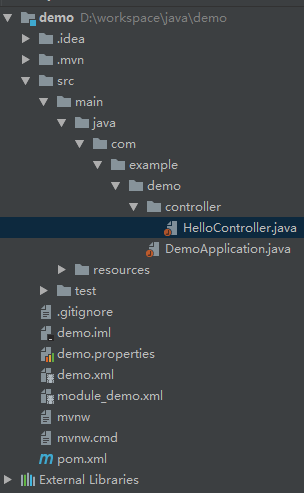

[id]: 729b1b40d6c111e8aa858b6a40460626
&emsp;&emsp;前面的博客有说到spring boot搭建见另一篇博文，其实那篇博文还没写，现在来填个坑。我们使用spring initializr来构建，idea和eclipse都支持这种方式，构建过程类似，这里以idea为例，详细记录构建过程。

###1.选择spring initializr



next

#### 2.设置参数


next

#### 3.选择依赖

&emsp;&emsp;在这里选择spring boot版本和web依赖（忽略sql的依赖，如有需要[点击这里](f),单独将mybatis的整合)，后面也可手动编辑pom文件修改增加删除依赖



这里我们选择web搭建一个简单的REST风格demo。然后next。

####4.设置项目存放地址



这样就成功构建了一个springboot项目。

#### 5.测试

&emsp;&emsp;现在新建一个controller包，包下新建一个HelloController,创建之后项目目录结构如下：



HelloController代码如下：

```java
@RestController
@RequestMapping("/home")
public class HelloController{
    @GetMapping("/hello")
    public String sayHello(){
        return "hello";
    }
}
```

然后运行项目，访问localhost:8080/home/hello即可看到hello字符串。
