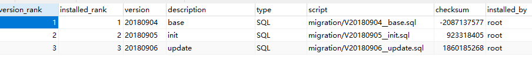
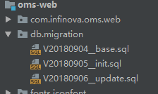

&emsp;&emsp;项目组最近加了一个新功能到代码中，使用flyway记录数据库版本变更，，，该工具会记录每次数据库结构的修改并生成sql文件存在指定目录上（当然必须用它来变更数据库，外部的变更它是无法感知的），然后每次启动时flyway会检查使用的数据库和当前项目代码中的sql变更版本是否一致，一致正常启动，不一致中如果是数据库落后将会更新数据库（这样能够保证代码在任何地方运行数据库都是一致的),否则就报错了。数据库中有一张表记录版本信息，如下图：

,同时本地代码中也有一个文件夹保存每次操作的sql语句，如下图：



通过对比checksum值来判断当前sql语句和生成数据库的执行语句是否一致，checksum值由CRC32计算后处理得出。

&emsp;&emsp;然后问题就来了，组中的其他人搭建好flyway后，项目文件生成了两个sql文件，我用git拉下来后启动报错，checkupsum值对不上，，然后我又不懂这个flyway完全不知道咋回事，然后就根据报错的位置一点点找到checkup值生成的代码，发现是CRC32计算的，，（就这么搞了一两个小时才发现是文件不一致了），但是都是从git拉的怎么就我不一致呢？？？想到可能是文件换行符的问题，遂把那几个sql文件的文件换行符全换成了crlf（windows中的换行符），然后居然就能够运行。。。关于为啥都从git拉取的文件换行符会不一样原因是：他们都用的那个小乌龟的可视化，我用的命令行。可视化工具自动配置了文件换行符的自动转换（这是git的一个智能功能，上传时将文件换行符替换为lf，，拉取时再替换为crlf，，这样保证中心仓库使用UNIX风格的换行符，，本地能够根据运行环境使用相对应的换行符风格），但是命令行并没有配置。

&emsp;&emsp;解决办法也很简单，开启git 的自动转换。

```
git config --global core.autocrlf true //开启换行符自动转换
git config --global core.safecrlf true //禁止混用换行符
```

