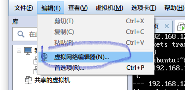
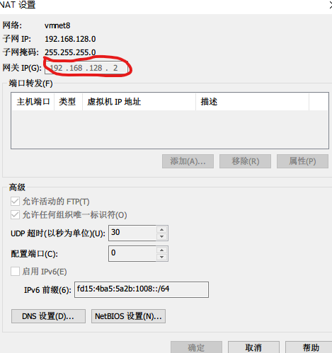
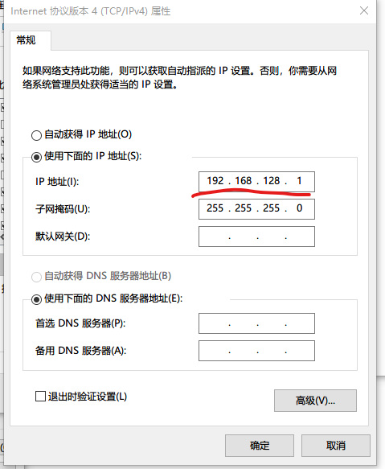

[id]:2018-08-04
[type]:软件
[tag]:vmware,vps,nat,ubuntu

## 1、wmware设置

&emsp;&emsp;这篇记录下nat网络模式下虚拟机与主机的相互ping通。首先使用wmware建立一个ubuntu虚拟机，网络模式选择nat模式。然后点击虚拟网络编辑：



接下来点击nat设置：


看到如下：



上面红框是关键，记录这个值，下面虚拟机设置静态ip要用到。

## 2、window网络设置

&emsp;&emsp;打开网络适配器页面，选择VMnet,右键->属性->Internet协议版本 4（TCP/IPV4）->属性，设置ip地址为上面上面网关地址最后一个数改成1，比如192.168.128.2就要设置为192.168.128.1，同时设置子网掩码为255.255.255.0，默认网关不要填。我的如下：



**如果想让虚拟机能够访问主机需要关闭主机的防火墙**

## 3、ubuntu设置

&emsp;&emsp;编辑/etc/network/interfaces

```bash
vim /etc/network/interfaces
# This file describes the network interfaces available on your system
# and how to activate them. For more information, see interfaces(5).

source /etc/network/interfaces.d/*

# The loopback network interface
auto lo
iface lo inet loopback

# The primary network interface
auto ens33
# dhcp 改成static，然后设置下面的address,netmask,gateway
iface ens33 inet static
address 192.168.128.129
netmask 255.255.255.0
gateway 192.168.128.2
# 设置dns
dns-nameservers 192.168.128.2


```

然后执行`/etc/init.d/networking restart`,或者重启虚拟机以启用网络设置。

## 3、验证

&emsp;&emsp;现在虚拟机中`ping 192.168.128.1`可以ping通，主机中`ping 192.168.128.129`也可ping通。